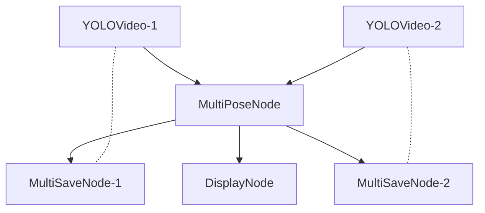

# How to construct a pose estimation pipeline
## Nodes
- **video: YOLOVideo** -- Similar to the other video nodes, no special configuration needed for it. Directly connect it to MultiPoseNode to use YOLO models on the source video. 
- **display: DisplayNode** -- This node is used to display the results after applying YOLO on video source, it connects directly to the Pose node and display each video in a separate window with window id matching the video src id
- **multi_vid_pose: MultiPoseNode** -- This node accepts multiple video node and applies specified YOLO model on frames of those videos. Need to specify specific task and scale of the YOLO model. Currently testing with YOLOv8 pose model, but also support segmentation and detection model, classification model is not supported. 
- **multi_save: MultiSaveNode** -- This node saves results from MultiPoseNode. Need to specify the save format ("df" (csv) or "vid" (mp4)) and the source_key of the video.

\* All functionality only tested on linux...

## Connection Example

## Example Config File
There is an example config file named "multi_pose_demo.json". That has 4 separate video node for 4 video src : webcam and online videos. It also has 4 separate save nodes for saving videos to video mp4 format or as df csv format.

## Saved Result Example:
### Pose Estimation
| frame_count      | name |class| confidence| box | keypoints
| ----------- | ----------- |----------- | ----------- | ----------- | ----------- |
|153| person| 0 | 0.928| "{'x1': 0.0, 'y1': 42.0, 'x2': 224.0, 'y2': 355.0}"|"{'x': [61.493...], 'y': [125.084...], 'visible': [0.919...]}"|

#### 17 Pose keypoints:
    facial: 
    - nose:0
    - left/right eye: 1,2
    - left/right ear: 3,4
    upper body:
    - left/right shoulder: 5,6
    - left/right elbow: 7,8
    - left/right wrist: 9,10
    lower body:
    - left/right hip: 11,12
    - left/right knee: 13,14
    - left/right ankle: 15,16

### Object Detection
| frame_count      | name |class| confidence| box | 
| ----------- | ----------- |----------- | ----------- | ----------- | 
|153| tv| 62 | 0.928| "{'x1': 0.0, 'y1': 42.0, 'x2': 224.0, 'y2': 355.0}"
### Segmentation
| frame_count      | name |class| confidence| box | segments
| ----------- | ----------- |----------- | ----------- | ----------- | ----------- |
|153| person| 0 | 0.928| "{'x1': 0.0, 'y1': 42.0, 'x2': 224.0, 'y2': 355.0}"|"{'x': [61.493...], 'y': [125.084...]}"|

*Segments gives coordinates of points in the segmentation mask

