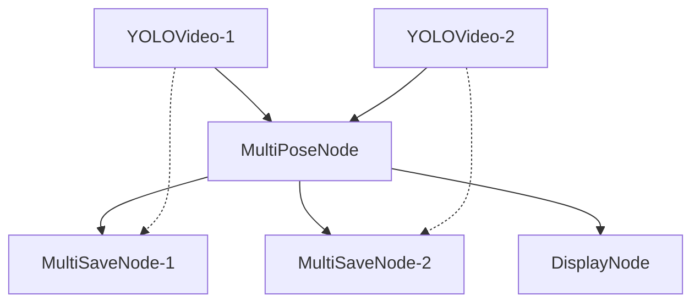

# How to construct a pose estimation pipeline
## Nodes
- **video: YOLOVideo** -- Similar to the other video nodes, no special configuration needed for it. Directly connect it to MultiPoseNode to use YOLO models on the source video. 
- **display: DisplayNode** -- This node is used to display the results after applying YOLO on video source, it connects directly to the Pose node and display each video in a separate window with window id matching the video src id
- **multi_vid_pose: MultiPoseNode** -- This node accepts multiple video node and applies specified YOLO model on frames of those videos. Need to specify specific task and scale of the YOLO model. 
- **multi_save: MultiSaveNode** -- This node saves results from MultiPoseNode. Need to specify the save format ("df" (csv) or "vid" (mp4)) and the source_key of the video.

## Connection Example

## Example Config
There is an example config file named "multi_pose_demo.json". That has two separate video node for two video src : webcam and an online video. It also has two separate save node for saving webcam to video mp4 format and online video as df csv format.